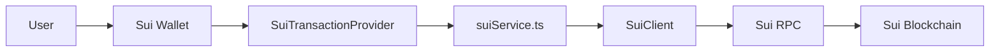

# Phase 2.3.1: Sui Transaction Implementation — Complete Guide

**Phase**: 2.3.1  
**Status**: ✅ Complete  
**Completion Date**: 2026-02-14

---

## Overview

Phase 2.3.1 implements full transaction capabilities for Sui blockchain, enabling programmatic token transfers, balance fetching, and transaction management. This phase builds upon Phase 2.3 (wallet connection) and matches the transaction capabilities delivered for Solana (Phase 2.1.1) and NEAR (Phase 2.2.1).

---

## Architecture



---

## Components

### 1. Sui Service Module (suiService.ts)

**Location**: [`apps/web/src/services/suiService.ts`](../apps/web/src/services/suiService.ts)

Core service module providing all transaction and balance operations for Sui blockchain.

#### Key Functions

**Balance Operations**:
- `getSuiBalance(address)` - Get SUI balance
- `getSuiTokenBalance(address, coinType)` - Get token balance
- `getAllBalances(address)` - Get all coin balances
- `hasSufficientBalance(address, amount, coinType)` - Check balance sufficiency

**Transaction Operations**:
- `sendSui(signAndExecute, recipient, amount)` - Send SUI tokens
- `sendSuiToken(signAndExecute, address, coinType, recipient, amount)` - Send Sui tokens
- `waitForTransaction(digest, timeout)` - Wait for confirmation
- `getTransactionStatus(digest)` - Get transaction details

**Utility Functions**:
- `getCoinMetadata(coinType)` - Get coin info (decimals, symbol)
- `getGasPrice()` - Get current gas price
- `estimateTransactionFee(txb)` - Estimate transaction cost
- `parseAmount(amount, decimals)` - Convert to smallest unit
- `formatAmount(amount, decimals)` - Convert to human-readable
- `isValidSuiAddress(address)` - Validate address format

#### Code Example

```typescript
import { getSuiBalance, sendSui, waitForTransaction } from '../services/suiService';

// Get balance
const balance = await getSuiBalance('0x1234...abcd');
console.log(`Balance: ${balance.balance} SUI`);
console.log(`MIST: ${balance.mist}`);

// Send SUI
const result = await sendSui(
  signAndExecuteTransactionBlock,
  '0xrecipient...',
  '1000000000' // 1 SUI in MIST
);

if (result.success) {
  console.log('Transaction digest:', result.digest);
  
  // Wait for confirmation
  const confirmed = await waitForTransaction(result.digest);
  console.log('Confirmed:', confirmed);
}
```

---

### 2. Sui Transaction Provider (SuiTransactionProvider.tsx)

**Location**: [`apps/web/src/components/SuiTransactionProvider.tsx`](../apps/web/src/components/SuiTransactionProvider.tsx)

React context provider that wraps the Sui service and provides transaction capabilities to the app.

#### Context Methods

**Balance Methods**:
- `getBalance()` - Get SUI balance for connected account
- `getTokenBalance(coinType)` - Get token balance for connected account
- `getAllBalances()` - Get all coin balances

**Transfer Methods**:
- `sendSUI(toAddress, amount)` - Send SUI tokens
- `sendToken(coinType, toAddress, amount)` - Send Sui tokens

**Utility Methods**:
- `waitForTx(digest)` - Wait for transaction confirmation
- `getTxStatus(digest)` - Get transaction status
- `getCoinInfo(coinType)` - Get coin metadata
- `getGasPrice()` - Get current gas price
- `checkSufficientBalance(amount, coinType)` - Check balance

**Helper Methods**:
- `parseAmount(amount, decimals)` - Convert to smallest unit
- `formatAmount(amount, decimals)` - Convert to human-readable
- `validateAddress(address)` - Validate Sui address

#### Usage Example

```typescript
import { useSuiTransaction } from '../components/SuiTransactionProvider';

function MyComponent() {
  const {
    getBalance,
    sendSUI,
    waitForTx,
    parseAmount,
    validateAddress,
  } = useSuiTransaction();

  const handleSend = async () => {
    // Get balance
    const balance = await getBalance();
    if (!balance) return;

    // Validate recipient
    if (!validateAddress(recipient)) {
      alert('Invalid address');
      return;
    }

    // Parse amount
    const amountInMist = parseAmount('1.5', 9); // 1.5 SUI

    // Send transaction
    const result = await sendSUI(recipient, amountInMist);
    
    if (result.success) {
      // Wait for confirmation
      const confirmed = await waitForTx(result.digest);
      console.log('Transaction confirmed:', confirmed);
    } else {
      console.error('Transaction failed:', result.error);
    }
  };

  return <button onClick={handleSend}>Send 1.5 SUI</button>;
}
```

---

### 3. Integration into Web3Provider

**Location**: [`apps/web/src/components/Web3Provider.tsx`](../apps/web/src/components/Web3Provider.tsx)

The SuiTransactionProvider is integrated into the main Web3Provider hierarchy:

```typescript
import { SuiTransactionProvider } from './SuiTransactionProvider';

<SuiClientProvider networks={networks} defaultNetwork="mainnet">
  <SuiWalletProvider autoConnect>
    <SuiTransactionProvider>
      {/* Other providers */}
    </SuiTransactionProvider>
  </SuiWalletProvider>
</SuiClientProvider>
```

---

## Transaction Capabilities

### 1. SUI Token Transfers

**Native SUI transfers using split coins pattern**:

```typescript
const { sendSUI, parseAmount } = useSuiTransaction();

// Send 2.5 SUI
const amountInMist = parseAmount('2.5', 9); // 2,500,000,000 MIST
const result = await sendSUI(
  '0xrecipient1234567890abcdef1234567890abcdef1234567890abcdef1234567890',
  amountInMist
);

if (result.success) {
  console.log('Transaction digest:', result.digest);
  console.log('View on explorer:', `https://suiexplorer.com/txblock/${result.digest}`);
}
```

**Transaction Details**:
- **Gas Cost**: ~0.001-0.005 SUI (~1,000,000 - 5,000,000 MIST)
- **Confirmation Time**: 2-5 seconds
- **Finality**: Instant finality after confirmation

---

### 2. Sui Token Transfers (USDC, USDT, etc.)

**Transfer any Sui coin type**:

```typescript
const { sendToken, parseAmount, getCoinInfo } = useSuiTransaction();

// Get token info
const usdcType = '0x5d4b302506645c37ff133b98c4b50a5ae14841659738d6d733d59d0d217a93bf::coin::COIN';
const metadata = await getCoinInfo(usdcType);
console.log('Decimals:', metadata.decimals); // 6

// Send 10 USDC
const amount = parseAmount('10', metadata.decimals); // 10,000,000
const result = await sendToken(
  usdcType,
  '0xrecipient...',
  amount
);
```

**Supported Tokens**:
- USDC: `0x5d4b...::coin::COIN`
- USDT: `0xc060...::coin::COIN`
- wETH: `0xaf8c...::coin::COIN`
- Any Sui-compatible token

**Transaction Details**:
- **Gas Cost**: ~0.001-0.01 SUI
- **Coin Merging**: Automatic if multiple coin objects
- **Confirmation Time**: 2-5 seconds

---

### 3. Balance Fetching

**Get SUI balance**:

```typescript
const { getBalance, formatAmount } = useSuiTransaction();

const balance = await getBalance();
if (balance) {
  console.log('Balance:', balance.balance, 'SUI');
  console.log('MIST:', balance.mist);
  
  // Format for display
  const formatted = formatAmount(balance.mist, 9);
  console.log('Formatted:', formatted);
}
```

**Get token balance**:

```typescript
const { getTokenBalance, getCoinInfo } = useSuiTransaction();

const usdcType = '0x5d4b...::coin::COIN';
const balance = await getTokenBalance(usdcType);

if (balance) {
  const metadata = await getCoinInfo(usdcType);
  const formatted = formatAmount(balance.balance, metadata.decimals);
  console.log(`Balance: ${formatted} ${metadata.symbol}`);
}
```

**Get all balances**:

```typescript
const { getAllBalances } = useSuiTransaction();

const balances = await getAllBalances();
balances.forEach(balance => {
  console.log(`${balance.coinType}: ${balance.totalBalance}`);
});
```

---

## Transaction Flow

### Complete Send Transaction Example

```typescript
import { useSuiTransaction } from '../components/SuiTransactionProvider';
import { useCurrentAccount } from '@mysten/dapp-kit';

function SendSuiForm() {
  const currentAccount = useCurrentAccount();
  const {
    getBalance,
    sendSUI,
    waitForTx,
    parseAmount,
    validateAddress,
    checkSufficientBalance,
  } = useSuiTransaction();

  const [recipient, setRecipient] = useState('');
  const [amount, setAmount] = useState('');
  const [status, setStatus] = useState('');

  const handleSend = async () => {
    try {
      setStatus('Validating...');
      
      // 1. Check wallet connection
      if (!currentAccount) {
        setStatus('Please connect wallet');
        return;
      }

      // 2. Validate recipient address
      if (!validateAddress(recipient)) {
        setStatus('Invalid recipient address');
        return;
      }

      // 3. Parse amount
      const amountInMist = parseAmount(amount, 9);

      // 4. Check sufficient balance (including gas)
      const hasFunds = await checkSufficientBalance(
        (BigInt(amountInMist) + BigInt(5000000)).toString() // Add 0.005 SUI for gas
      );
      
      if (!hasFunds) {
        setStatus('Insufficient balance');
        return;
      }

      // 5. Send transaction
      setStatus('Sending transaction...');
      const result = await sendSUI(recipient, amountInMist);

      if (!result.success) {
        setStatus(`Failed: ${result.error}`);
        return;
      }

      // 6. Wait for confirmation
      setStatus('Waiting for confirmation...');
      const confirmed = await waitForTx(result.digest);

      if (confirmed) {
        setStatus('✅ Transaction confirmed!');
        console.log('Digest:', result.digest);
      } else {
        setStatus('⚠️ Confirmation timeout');
      }
    } catch (error: any) {
      setStatus(`Error: ${error.message}`);
    }
  };

  return (
    <div>
      <input 
        placeholder="Recipient address (0x...)"
        value={recipient}
        onChange={e => setRecipient(e.target.value)}
      />
      <input 
        placeholder="Amount (SUI)"
        value={amount}
        onChange={e => setAmount(e.target.value)}
      />
      <button onClick={handleSend}>Send SUI</button>
      <p>{status}</p>
    </div>
  );
}
```

---

## Transaction Fees & Gas

### Gas Price

```typescript
const { getGasPrice } = useSuiTransaction();

const gasPrice = await getGasPrice();
console.log('Gas price:', gasPrice, 'MIST per gas unit');
```

### Fee Estimation

```typescript
import { TransactionBlock } from '@mysten/sui.js/transactions';
import { estimateTransactionFee } from '../services/suiService';

const txb = new TransactionBlock();
// ... build transaction

const estimatedFee = await estimateTransactionFee(txb);
console.log('Estimated fee:', estimatedFee, 'MIST');
console.log('In SUI:', (parseFloat(estimatedFee) / 1e9).toFixed(6));
```

### Typical Fees

| Transaction Type | Gas Cost (MIST) | Gas Cost (SUI) |
|-----------------|----------------|----------------|
| SUI Transfer | 1,000,000 - 3,000,000 | 0.001 - 0.003 |
| Token Transfer | 1,000,000 - 5,000,000 | 0.001 - 0.005 |
| Token Transfer (merge) | 3,000,000 - 10,000,000 | 0.003 - 0.01 |
| Complex Transaction | 5,000,000+ | 0.005+ |

---

## Address Format & Validation

### Sui Address Format

- **Format**: 32-byte hex with `0x` prefix
- **Length**: 66 characters (including `0x`)
- **Example**: `0x1234567890abcdef1234567890abcdef1234567890abcdef1234567890abcdef`
- **Regex**: `^0x[a-fA-F0-9]{64}$`

### Validation

```typescript
const { validateAddress } = useSuiTransaction();

const address = '0x1234...';
if (validateAddress(address)) {
  console.log('Valid Sui address');
} else {
  console.log('Invalid address');
}
```

---

## Coin Types & Token IDs

### Common Sui Tokens

```typescript
// Native SUI
const SUI = '0x2::sui::SUI';

// USDC
const USDC = '0x5d4b302506645c37ff133b98c4b50a5ae14841659738d6d733d59d0d217a93bf::coin::COIN';

// USDT
const USDT = '0xc060006111016b8a020ad5b33834984a437aaa7d3c74c18e09a95d48aceab08c::coin::COIN';

// wETH
const WETH = '0xaf8cd5edc19c4512f4259f0bee101a40d41ebed738ade5874359610ef8eeced5::coin::COIN';
```

### Get Metadata

```typescript
const { getCoinInfo } = useSuiTransaction();

const metadata = await getCoinInfo(USDC);
console.log('Symbol:', metadata.symbol); // USDC
console.log('Decimals:', metadata.decimals); // 6
console.log('Name:', metadata.name); // USD Coin
```

---

## Error Handling

### Common Errors

```typescript
const { sendSUI } = useSuiTransaction();

try {
  const result = await sendSUI(recipient, amount);
  
  if (!result.success) {
    switch (result.error) {
      case 'Wallet not connected':
        // Prompt user to connect wallet
        break;
      case 'Invalid recipient address':
        // Show address validation error
        break;
      case 'Insufficient balance':
        // Show insufficient funds message
        break;
      case 'User rejected transaction':
        // Transaction cancelled by user
        break;
      default:
        console.error('Transaction failed:', result.error);
    }
  }
} catch (error) {
  console.error('Unexpected error:', error);
}
```

### Transaction Status Codes

```typescript
const { getTxStatus } = useSuiTransaction();

const status = await getTxStatus(digest);

switch (status.status) {
  case 'success':
    console.log('Transaction successful');
    break;
  case 'failure':
    console.log('Transaction failed:', status.effects?.status?.error);
    break;
  case 'unknown':
    console.log('Transaction not found');
    break;
}
```

---

## Testing

### Prerequisites

1. **Install Sui Wallet**
   - [Sui Wallet Extension](https://chrome.google.com/webstore/detail/sui-wallet/)
   - Create wallet or import existing
   - Fund with testnet/mainnet SUI

2. **Get Test Tokens**
   - Testnet: Use [Sui Faucet](https://discord.gg/sui)
   - Mainnet: Purchase from exchange

### Test Scenarios

#### 1. Balance Fetching

```bash
Test Steps:
1. Connect Sui wallet
2. Call getBalance()
3. Verify balance matches wallet
4. Try getTokenBalance(USDC)
5. Verify token balance

Expected: ✅ Balances fetched correctly
```

#### 2. SUI Transfer

```bash
Test Steps:
1. Connect Sui wallet
2. Enter recipient address
3. Enter amount (e.g., 0.1 SUI)
4. Click send
5. Approve in wallet
6. Wait for confirmation

Expected: ✅ Transaction succeeds, balance updates
```

#### 3. Token Transfer

```bash
Test Steps:
1. Connect Sui wallet with USDC balance
2. Enter recipient address
3. Enter USDC amount
4. Send transaction
5. Approve in wallet
6. Check confirmation

Expected: ✅ USDC transferred, gas paid in SUI
```

#### 4. Insufficient Balance

```bash
Test Steps:
1. Connect wallet with low balance
2. Try to send more than balance
3. Observe error handling

Expected: ✅ Error: "Insufficient balance"
```

#### 5. Transaction Confirmation

```bash
Test Steps:
1. Send SUI transaction
2. Get transaction digest
3. Call waitForTx(digest)
4. Check confirmation

Expected: ✅ Returns true when confirmed
```

---

## Troubleshooting

### Issue: "Wallet not connected"

**Symptom**: Transaction methods return "not connected" error

**Solutions**:
1. Check `useCurrentAccount()` returns account
2. Verify wallet is unlocked
3. Reconnect wallet
4. Check provider hierarchy

### Issue: "Insufficient gas"

**Symptom**: Transaction fails with gas error

**Solutions**:
1. Check SUI balance (need ~0.005 SUI for gas)
2. Get SUI from faucet or exchange
3. Reduce transaction complexity

### Issue: "Coin not found"

**Symptom**: Token transfer fails with "no coins found"

**Solutions**:
1. Check token balance > 0
2. Verify correct coin type
3. Check wallet owns coin objects
4. Refresh wallet/browser

### Issue: "Transaction timeout"

**Symptom**: `waitForTransaction` returns false

**Solutions**:
1. Check network connectivity
2. Verify transaction digest is correct
3. Check transaction on explorer
4. Increase timeout (default 30s)

### Issue: "Invalid address"

**Symptom**: Address validation fails

**Solutions**:
1. Ensure 0x prefix
2. Check address is 66 characters
3. Verify hex characters only
4. No spaces or special characters

---

## Best Practices

### 1. Always Validate Inputs

```typescript
// Validate address
if (!validateAddress(recipient)) {
  throw new Error('Invalid address');
}

// Validate amount
const amount = parseFloat(amountStr);
if (isNaN(amount) || amount <= 0) {
  throw new Error('Invalid amount');
}
```

### 2. Check Balance Before Transaction

```typescript
const amountInMist = parseAmount(amount, 9);
const gasBuffer = '5000000'; // 0.005 SUI

const hasFunds = await checkSufficientBalance(
  (BigInt(amountInMist) + BigInt(gasBuffer)).toString()
);

if (!hasFunds) {
  throw new Error('Insufficient balance including gas');
}
```

### 3. Handle User Rejections

```typescript
try {
  const result = await sendSUI(recipient, amount);
  if (!result.success && result.error.includes('rejected')) {
    console.log('User cancelled transaction');
    return;
  }
} catch (error: any) {
  if (error.message.includes('User rejected')) {
    console.log('Transaction cancelled');
  }
}
```

### 4. Show Transaction Progress

```typescript
const [status, setStatus] = useState('');

setStatus('Preparing transaction...');
const result = await sendSUI(recipient, amount);

setStatus('Waiting for confirmation...');
const confirmed = await waitForTx(result.digest);

setStatus(confirmed ? 'Confirmed!' : 'Pending...');
```

### 5. Provide Explorer Links

```typescript
const explorerUrl = `https://suiexplorer.com/txblock/${result.digest}?network=mainnet`;
console.log('View transaction:', explorerUrl);
```

---

## Performance Considerations

### 1. Batch Balance Queries

```typescript
// Instead of multiple calls
const suiBalance = await getBalance();
const usdcBalance = await getTokenBalance(USDC);

// Use getAllBalances
const allBalances = await getAllBalances();
```

### 2. Cache Metadata

```typescript
const metadataCache = new Map();

async function getCachedMetadata(coinType: string) {
  if (!metadataCache.has(coinType)) {
    const metadata = await getCoinInfo(coinType);
    metadataCache.set(coinType, metadata);
  }
  return metadataCache.get(coinType);
}
```

### 3. Optimize Polling

```typescript
// Don't poll too frequently
await waitForTransaction(digest, 30000); // 30s timeout with 2s intervals
```

---

## Security Considerations

### 1. Validate All User Inputs

- Always validate addresses before transactions
- Sanitize amount inputs
- Implement max transaction limits

### 2. Show Transaction Details

- Display recipient address
- Show amount being sent
- Display gas fees
- Require user confirmation

### 3. Handle Private Keys Securely

- Never expose private keys
- Let wallet handle signing
- Don't store sensitive data

### 4. Gas Fee Protection

- Set reasonable gas limits
- Warn users about high fees
- Provide fee estimates before transaction

---

## Integration with Swap Flow

### Using Sui Transactions in Swaps

```typescript
import { useSuiTransaction } from '../components/SuiTransactionProvider';

function SwapWithSui() {
  const { sendSUI, getBalance, validateAddress } = useSuiTransaction();

  const handleSwap = async (depositAddress: string, amount: string) => {
    // 1. Validate deposit address from 1Click
    if (!validateAddress(depositAddress)) {
      throw new Error('Invalid deposit address from 1Click');
    }

    // 2. Check balance
    const balance = await getBalance();
    if (!balance || parseFloat(balance.balance) < parseFloat(amount)) {
      throw new Error('Insufficient balance');
    }

    // 3. Send to 1Click deposit address
    const amountInMist = parseAmount(amount, 9);
    const result = await sendSUI(depositAddress, amountInMist);

    if (!result.success) {
      throw new Error(`Transaction failed: ${result.error}`);
    }

    // 4. Submit transaction hash to backend
    await fetch('/api/deposit/submit', {
      method: 'POST',
      body: JSON.stringify({
        depositAddress,
        txHash: result.digest,
      }),
    });

    return result.digest;
  };

  return (/* UI */);
}
```

---

## Resources

### Documentation
- [Sui TypeScript SDK](https://sdk.mystenlabs.com/typescript)
- [Sui Documentation](https://docs.sui.io/)
- [dApp Kit](https://sdk.mystenlabs.com/dapp-kit)

### Tools
- [Sui Explorer](https://suiexplorer.com/)
- [Sui Vision](https://suivision.xyz/)
- [Sui Scan](https://suiscan.xyz/)

### Networks
- **Mainnet RPC**: `https://fullnode.mainnet.sui.io:443`
- **Testnet RPC**: `https://fullnode.testnet.sui.io:443`
- **Devnet RPC**: `https://fullnode.devnet.sui.io:443`

---

## Summary

Phase 2.3.1 successfully delivers full transaction capabilities for Sui blockchain:

✅ **Balance Operations**:
- SUI balance fetching
- Token balance fetching
- All balances query
- Balance validation

✅ **Transaction Operations**:
- SUI token transfers
- Sui token transfers (USDC, USDT, etc.)
- Transaction building and signing
- Transaction confirmation tracking

✅ **Utility Functions**:
- Address validation
- Amount parsing/formatting
- Gas price queries
- Fee estimation
- Coin metadata fetching

✅ **Developer Experience**:
- Clean React hooks API
- Comprehensive error handling
- TypeScript support
- Well-documented functions

With Phase 2.3.1 complete, Sui has the same transaction capabilities as Solana and NEAR, enabling users to programmatically send tokens directly from the Sapphire interface for an enhanced user experience.

---

**Status**: Phase 2.3.1 Complete — Ready for Testing and Integration
