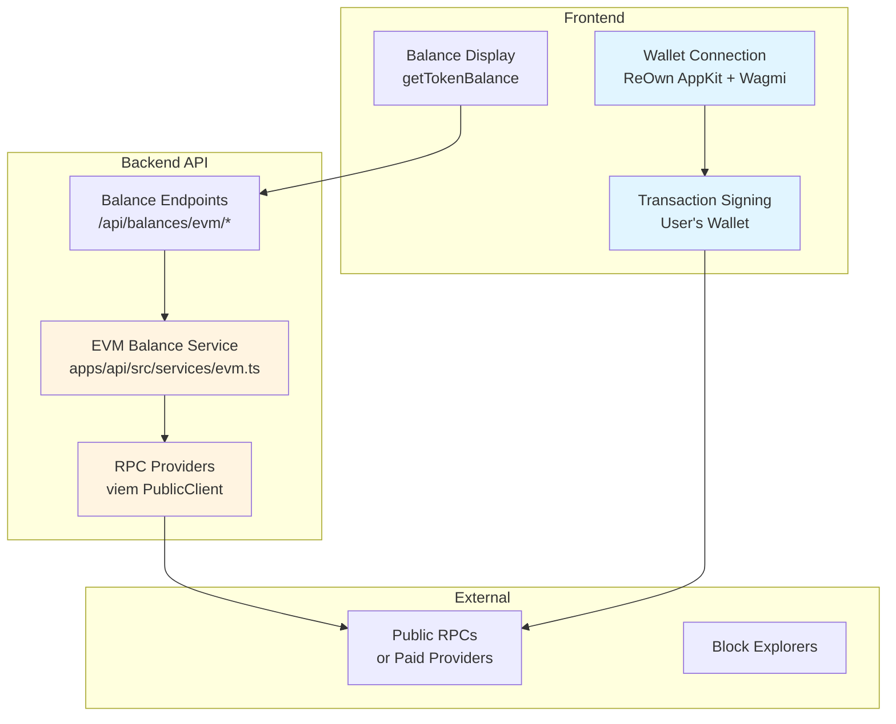

# EVM Chains Integration Plan

## Executive Summary

This plan outlines the integration of six EVM chains into the Sapphire cross-chain swap platform:
- **Base** (Coinbase L2)
- **Ethereum Mainnet**
- **Arbitrum**
- **Berachain**
- **Monad**
- **BNB Chain** (BSC)

The integration follows your existing architecture: **wallets handle transaction signing while the backend provides balance data via RPC calls**.

---

## Current State Analysis

### ✅ Already Configured
- **Wagmi & Viem**: Already installed and configured
- **ReOwn AppKit**: EVM wallet connection infrastructure in place
- **Existing EVM chains**: Ethereum, Polygon, Optimism, Arbitrum, Base, Sepolia
- **Architecture pattern**: Backend API endpoints for balance fetching

### 🔧 What's Missing
- Berachain, Monad, BNB Chain configurations
- EVM balance service (similar to `sui.ts`)
- API endpoints for EVM native + ERC-20 balances
- Frontend balance fetching integration
- RPC configuration management
- Chain-specific metadata (explorers, native tokens)

---

## Architecture Overview



---

## Implementation Plan

### Phase 1: Chain Configuration & Setup

#### 1.1 Add Missing Chain Definitions
**File**: `apps/web/src/components/Web3Provider.tsx`

Add chain imports and configurations:

```typescript
import { 
  mainnet, 
  polygon, 
  optimism, 
  arbitrum, 
  base, 
  sepolia,
  bsc,          // BNB Chain
  berachainTestnet  // Or custom Berachain config
} from 'wagmi/chains';

// Custom chain definitions for chains not in wagmi
const berachain = {
  id: 80084, // Berachain bArtio testnet, or mainnet ID when available
  name: 'Berachain',
  nativeCurrency: { name: 'BERA', symbol: 'BERA', decimals: 18 },
  rpcUrls: {
    default: { http: ['https://artio.rpc.berachain.com'] },
    public: { http: ['https://artio.rpc.berachain.com'] },
  },
  blockExplorers: {
    default: { name: 'Beratrail', url: 'https://artio.beratrail.io' },
  },
} as const;

const monad = {
  id: 41454, // Placeholder - use actual Monad chain ID
  name: 'Monad',
  nativeCurrency: { name: 'MON', symbol: 'MON', decimals: 18 },
  rpcUrls: {
    default: { http: [process.env.NEXT_PUBLIC_MONAD_RPC_URL || 'https://rpc.monad.xyz'] },
    public: { http: ['https://rpc.monad.xyz'] },
  },
  blockExplorers: {
    default: { name: 'Monad Explorer', url: 'https://explorer.monad.xyz' },
  },
} as const;
```

**Update wagmi adapter**:
```typescript
const evmChains = [
  mainnet, 
  polygon, 
  optimism, 
  arbitrum, 
  base, 
  bsc,
  berachain,
  monad,
  sepolia // Keep for testing
];
```

#### 1.2 Environment Variables
**File**: `.env.example`

Add RPC configurations:
```bash
# EVM RPC Endpoints (Optional - defaults to public RPCs)
# For production, use paid providers like Alchemy, Infura, or QuickNode

# Ethereum Mainnet
ETHEREUM_RPC_URL=https://eth-mainnet.g.alchemy.com/v2/YOUR_API_KEY

# Base (Coinbase L2)
BASE_RPC_URL=https://base-mainnet.g.alchemy.com/v2/YOUR_API_KEY

# Arbitrum
ARBITRUM_RPC_URL=https://arb-mainnet.g.alchemy.com/v2/YOUR_API_KEY

# BNB Chain (BSC)
BSC_RPC_URL=https://bsc-dataseed1.binance.org

# Berachain
BERACHAIN_RPC_URL=https://artio.rpc.berachain.com

# Monad
MONAD_RPC_URL=https://rpc.monad.xyz
```

---

### Phase 2: Backend EVM Service

#### 2.1 Create EVM Balance Service
**File**: `apps/api/src/services/evm.ts`

```typescript
import { createPublicClient, http, PublicClient, formatUnits, Address } from 'viem';
import { 
  mainnet, 
  polygon, 
  optimism, 
  arbitrum, 
  base, 
  bsc 
} from 'viem/chains';

/**
 * EVM Balance Service
 * Fetches native and ERC-20 token balances across EVM chains
 */

// ERC-20 ABI for balanceOf
const ERC20_ABI = [
  {
    constant: true,
    inputs: [{ name: '_owner', type: 'address' }],
    name: 'balanceOf',
    outputs: [{ name: 'balance', type: 'uint256' }],
    type: 'function',
  },
  {
    constant: true,
    inputs: [],
    name: 'decimals',
    outputs: [{ name: '', type: 'uint8' }],
    type: 'function',
  },
] as const;

// Chain configurations with RPC URLs
const CHAIN_CONFIGS = {
  ethereum: {
    chain: mainnet,
    rpcUrl: process.env.ETHEREUM_RPC_URL || 'https://eth.llamarpc.com',
  },
  base: {
    chain: base,
    rpcUrl: process.env.BASE_RPC_URL || 'https://mainnet.base.org',
  },
  arbitrum: {
    chain: arbitrum,
    rpcUrl: process.env.ARBITRUM_RPC_URL || 'https://arb1.arbitrum.io/rpc',
  },
  bsc: {
    chain: bsc,
    rpcUrl: process.env.BSC_RPC_URL || 'https://bsc-dataseed1.binance.org',
  },
  polygon: {
    chain: polygon,
    rpcUrl: process.env.POLYGON_RPC_URL || 'https://polygon-rpc.com',
  },
  optimism: {
    chain: optimism,
    rpcUrl: process.env.OPTIMISM_RPC_URL || 'https://mainnet.optimism.io',
  },
} as const;

type SupportedChain = keyof typeof CHAIN_CONFIGS;

// Cache for public clients
const clientCache: Map<string, PublicClient> = new Map();

/**
 * Get or create a public client for a specific chain
 */
function getPublicClient(chainName: SupportedChain): PublicClient {
  if (clientCache.has(chainName)) {
    return clientCache.get(chainName)!;
  }

  const config = CHAIN_CONFIGS[chainName];
  const client = createPublicClient({
    chain: config.chain,
    transport: http(config.rpcUrl),
  });

  clientCache.set(chainName, client);
  return client;
}

/**
 * Get native token balance (ETH, BNB, etc.)
 */
export async function getNativeBalance(
  chainName: SupportedChain,
  address: string
): Promise<{
  balance: string;
  balanceWei: string;
  address: string;
  chain: string;
}> {
  try {
    const client = getPublicClient(chainName);
    const balanceWei = await client.getBalance({ address: address as Address });
    const balance = formatUnits(balanceWei, 18); // Native tokens are 18 decimals

    console.log(`[EVM-${chainName.toUpperCase()}] Native balance:`, {
      address,
      balanceWei: balanceWei.toString(),
      balance,
    });

    return {
      balance: parseFloat(balance).toFixed(4),
      balanceWei: balanceWei.toString(),
      address,
      chain: chainName,
    };
  } catch (error: any) {
    console.error(`[EVM-${chainName.toUpperCase()}] Error fetching native balance:`, error.message);
    throw error;
  }
}

/**
 * Get ERC-20 token balance
 */
export async function getTokenBalance(
  chainName: SupportedChain,
  address: string,
  tokenAddress: string,
  decimals?: number
): Promise<{
  balance: string;
  balanceRaw: string;
  address: string;
  tokenAddress: string;
  chain: string;
  decimals: number;
}> {
  try {
    const client = getPublicClient(chainName);

    // Fetch balance
    const balanceRaw = await client.readContract({
      address: tokenAddress as Address,
      abi: ERC20_ABI,
      functionName: 'balanceOf',
      args: [address as Address],
    });

    // Fetch decimals if not provided
    let tokenDecimals = decimals;
    if (!tokenDecimals) {
      tokenDecimals = await client.readContract({
        address: tokenAddress as Address,
        abi: ERC20_ABI,
        functionName: 'decimals',
      });
    }

    const balance = formatUnits(balanceRaw as bigint, tokenDecimals);

    console.log(`[EVM-${chainName.toUpperCase()}] Token balance:`, {
      address,
      tokenAddress,
      balanceRaw: balanceRaw.toString(),
      balance,
      decimals: tokenDecimals,
    });

    return {
      balance: parseFloat(balance).toFixed(4),
      balanceRaw: balanceRaw.toString(),
      address,
      tokenAddress,
      chain: chainName,
      decimals: tokenDecimals,
    };
  } catch (error: any) {
    console.error(`[EVM-${chainName.toUpperCase()}] Error fetching token balance:`, error.message);
    throw error;
  }
}

/**
 * Get multiple token balances at once
 */
export async function getMultipleBalances(
  chainName: SupportedChain,
  address: string,
  tokenAddresses: string[]
): Promise<Array<{
  tokenAddress: string;
  balance: string;
  balanceRaw: string;
  decimals: number;
}>> {
  const results = await Promise.allSettled(
    tokenAddresses.map((tokenAddress) =>
      getTokenBalance(chainName, address, tokenAddress)
    )
  );

  return results
    .filter((result) => result.status === 'fulfilled')
    .map((result) => {
      const data = (result as PromiseFulfilledResult<any>).value;
      return {
        tokenAddress: data.tokenAddress,
        balance: data.balance,
        balanceRaw: data.balanceRaw,
        decimals: data.decimals,
      };
    });
}

export default {
  getNativeBalance,
  getTokenBalance,
  getMultipleBalances,
  CHAIN_CONFIGS,
};
```

#### 2.2 Add API Routes
**File**: `apps/api/src/routes/balances.ts`

Add to existing file:

```typescript
import * as evmService from '../services/evm';

/**
 * GET /api/balances/evm/:chain/:address
 * Get native token balance (ETH, BNB, etc.)
 * Supported chains: ethereum, base, arbitrum, bsc, polygon, optimism
 */
router.get('/evm/:chain/:address', async (req: Request, res: Response) => {
  try {
    const { chain, address } = req.params;
    
    if (!chain || !address) {
      return res.status(400).json({ error: 'Chain and address are required' });
    }

    // Validate chain
    const supportedChains = ['ethereum', 'base', 'arbitrum', 'bsc', 'polygon', 'optimism'];
    if (!supportedChains.includes(chain)) {
      return res.status(400).json({ 
        error: 'Unsupported chain',
        supportedChains 
      });
    }

    const result = await evmService.getNativeBalance(
      chain as any,
      address
    );
    
    res.json(result);
  } catch (error: any) {
    console.error(`[EVM] Failed to fetch native balance:`, error);
    res.status(500).json({
      error: 'Failed to fetch balance',
      message: error.message,
    });
  }
});

/**
 * GET /api/balances/evm-token/:chain/:address
 * Get ERC-20 token balance
 * Query params: tokenAddress, decimals (optional)
 */
router.get('/evm-token/:chain/:address', async (req: Request, res: Response) => {
  try {
    const { chain, address } = req.params;
    const { tokenAddress, decimals } = req.query;
    
    if (!chain || !address || !tokenAddress) {
      return res.status(400).json({
        error: 'Chain, address, and tokenAddress are required'
      });
    }

    const result = await evmService.getTokenBalance(
      chain as any,
      address,
      tokenAddress as string,
      decimals ? parseInt(decimals as string) : undefined
    );
    
    res.json(result);
  } catch (error: any) {
    console.error(`[EVM] Failed to fetch token balance:`, error);
    res.status(500).json({
      error: 'Failed to fetch token balance',
      message: error.message,
    });
  }
});
```

#### 2.3 Add viem to API Dependencies
**File**: `apps/api/package.json`

```json
{
  "dependencies": {
    "viem": "^2.45.3"
  }
}
```

---

### Phase 3: Frontend Integration

#### 3.1 Update Balance Fetching Library
**File**: `apps/web/src/lib/balances.ts`

Add EVM balance functions:

```typescript
/**
 * Fetch native EVM balance (ETH, BNB, etc.)
 * @param chain - Chain name (ethereum, base, arbitrum, bsc, polygon, optimism)
 * @param address - EVM wallet address
 */
export async function getEvmBalance(
  chain: string,
  address: string
): Promise<string> {
  try {
    const response = await fetch(
      `${API_URL}/api/balances/evm/${chain}/${address}`
    );
    
    if (!response.ok) {
      throw new Error(`Failed to fetch EVM balance: ${response.statusText}`);
    }
    
    const data = await response.json();
    return data.balance;
  } catch (error) {
    console.error(`Failed to fetch ${chain} balance:`, error);
    return '0.00';
  }
}

/**
 * Fetch ERC-20 token balance
 * @param chain - Chain name
 * @param address - Wallet address
 * @param tokenAddress - Token contract address
 * @param decimals - Token decimals (optional)
 */
export async function getEvmTokenBalance(
  chain: string,
  address: string,
  tokenAddress: string,
  decimals?: number
): Promise<string> {
  try {
    const params = new URLSearchParams({ tokenAddress });
    if (decimals) params.append('decimals', decimals.toString());
    
    const response = await fetch(
      `${API_URL}/api/balances/evm-token/${chain}/${address}?${params}`
    );
    
    if (!response.ok) {
      throw new Error(`Failed to fetch EVM token balance: ${response.statusText}`);
    }
    
    const data = await response.json();
    return data.balance;
  } catch (error) {
    console.error(`Failed to fetch ${chain} token balance:`, error);
    return '0.00';
  }
}
```

Update the `getTokenBalance` function to handle EVM chains:

```typescript
export async function getTokenBalance(
  address: string,
  token: {
    blockchain?: string;
    contractAddress?: string;
    address?: string;
    decimals: number;
    symbol: string;
  }
): Promise<string> {
  const blockchain = (token.blockchain || 'near').toLowerCase();
  
  // EVM chains
  const evmChains = ['ethereum', 'base', 'arbitrum', 'bsc', 'polygon', 'optimism', 'berachain', 'monad'];
  if (evmChains.includes(blockchain)) {
    // Check if it's native token
    const nativeTokens = ['ETH', 'BNB', 'MATIC', 'BERA', 'MON'];
    if (nativeTokens.includes(token.symbol)) {
      return getEvmBalance(blockchain, address);
    }
    
    // ERC-20 token
    if (token.contractAddress || token.address) {
      return getEvmTokenBalance(
        blockchain,
        address,
        token.contractAddress || token.address!,
        token.decimals
      );
    }
  }
  
  // ... existing NEAR, Sui, Solana logic ...
}
```

#### 3.2 Update Chain Mapping
**File**: `apps/web/src/components/SwapForm.tsx`

Update chain recognition to map specific EVM chains:

```typescript
// Map blockchain identifiers to specific chains
const getChainForBlockchain = (blockchain: string): string => {
  const mapping: Record<string, string> = {
    'ethereum': 'evm',
    'base': 'evm',
    'arbitrum': 'evm',
    'bsc': 'evm',
    'polygon': 'evm',
    'optimism': 'evm',
    'berachain': 'evm',
    'monad': 'evm',
    'solana': 'solana',
    'sui': 'sui',
    'near': 'near',
  };
  
  return mapping[blockchain.toLowerCase()] || 'near';
};
```

---

### Phase 4: Chain Metadata & Configuration

#### 4.1 Chain Configuration File
**File**: `apps/web/src/lib/chains.ts` (new file)

```typescript
export interface ChainConfig {
  id: number;
  name: string;
  displayName: string;
  nativeToken: {
    symbol: string;
    name: string;
    decimals: number;
  };
  explorer: string;
  rpcUrls: string[];
  testnet?: boolean;
}

export const EVM_CHAINS: Record<string, ChainConfig> = {
  ethereum: {
    id: 1,
    name: 'ethereum',
    displayName: 'Ethereum',
    nativeToken: { symbol: 'ETH', name: 'Ether', decimals: 18 },
    explorer: 'https://etherscan.io',
    rpcUrls: ['https://eth.llamarpc.com'],
  },
  base: {
    id: 8453,
    name: 'base',
    displayName: 'Base',
    nativeToken: { symbol: 'ETH', name: 'Ether', decimals: 18 },
    explorer: 'https://basescan.org',
    rpcUrls: ['https://mainnet.base.org'],
  },
  arbitrum: {
    id: 42161,
    name: 'arbitrum',
    displayName: 'Arbitrum One',
    nativeToken: { symbol: 'ETH', name: 'Ether', decimals: 18 },
    explorer: 'https://arbiscan.io',
    rpcUrls: ['https://arb1.arbitrum.io/rpc'],
  },
  bsc: {
    id: 56,
    name: 'bsc',
    displayName: 'BNB Chain',
    nativeToken: { symbol: 'BNB', name: 'BNB', decimals: 18 },
    explorer: 'https://bscscan.com',
    rpcUrls: ['https://bsc-dataseed1.binance.org'],
  },
  berachain: {
    id: 80084,
    name: 'berachain',
    displayName: 'Berachain',
    nativeToken: { symbol: 'BERA', name: 'BERA', decimals: 18 },
    explorer: 'https://artio.beratrail.io',
    rpcUrls: ['https://artio.rpc.berachain.com'],
    testnet: true,
  },
  monad: {
    id: 41454, // Placeholder - update with actual
    name: 'monad',
    displayName: 'Monad',
    nativeToken: { symbol: 'MON', name: 'MON', decimals: 18 },
    explorer: 'https://explorer.monad.xyz',
    rpcUrls: ['https://rpc.monad.xyz'],
  },
  polygon: {
    id: 137,
    name: 'polygon',
    displayName: 'Polygon',
    nativeToken: { symbol: 'MATIC', name: 'Matic', decimals: 18 },
    explorer: 'https://polygonscan.com',
    rpcUrls: ['https://polygon-rpc.com'],
  },
  optimism: {
    id: 10,
    name: 'optimism',
    displayName: 'Optimism',
    nativeToken: { symbol: 'ETH', name: 'Ether', decimals: 18 },
    explorer: 'https://optimistic.etherscan.io',
    rpcUrls: ['https://mainnet.optimism.io'],
  },
};

/**
 * Get block explorer URL for a transaction
 */
export function getExplorerTxUrl(chain: string, txHash: string): string {
  const config = EVM_CHAINS[chain.toLowerCase()];
  if (config) {
    return `${config.explorer}/tx/${txHash}`;
  }
  return `https://etherscan.io/tx/${txHash}`;
}

/**
 * Get block explorer URL for an address
 */
export function getExplorerAddressUrl(chain: string, address: string): string {
  const config = EVM_CHAINS[chain.toLowerCase()];
  if (config) {
    return `${config.explorer}/address/${address}`;
  }
  return `https://etherscan.io/address/${address}`;
}
```

#### 4.2 Update Transaction Modal
**File**: `apps/web/src/components/TransactionModal.tsx`

Import and use the new chain config:

```typescript
import { getExplorerTxUrl, EVM_CHAINS } from '@/lib/chains';

const getExplorerLink = (txHash: string, assetId: string) => {
  const asset = assetId?.toLowerCase() || '';
  
  // Check EVM chains first
  for (const [chainName, config] of Object.entries(EVM_CHAINS)) {
    if (asset.includes(chainName) || asset.includes(config.displayName.toLowerCase())) {
      return getExplorerTxUrl(chainName, txHash);
    }
  }
  
  // Fallback to existing logic for non-EVM chains
  if (asset.includes('sol') || asset.includes('solana')) {
    return `https://solscan.io/tx/${txHash}`;
  } else if (asset.includes('near')) {
    return `https://nearblocks.io/txns/${txHash}`;
  } else if (asset.includes('sui')) {
    return `https://suiscan.xyz/mainnet/tx/${txHash}`;
  }
  
  return `https://explorer.near-intents.org/`;
};
```

---

### Phase 5: Testing Strategy

#### 5.1 Backend Testing
```bash
# Test native balance
curl http://localhost:3001/api/balances/evm/ethereum/0x742d35Cc6634C0532925a3b844Bc9e7595f0bEb

# Test token balance (USDC on Base)
curl "http://localhost:3001/api/balances/evm-token/base/0xYOUR_ADDRESS?tokenAddress=0x833589fCD6eDb6E08f4c7C32D4f71b54bdA02913&decimals=6"

# Test BSC native balance
curl http://localhost:3001/api/balances/evm/bsc/0xYOUR_ADDRESS
```

#### 5.2 Frontend Testing Checklist
- [ ] Connect wallet using ReOwn AppKit
- [ ] Verify address shows in wallet context
- [ ] Check balance fetching for native tokens (ETH, BNB, etc.)
- [ ] Check balance fetching for ERC-20 tokens
- [ ] Verify chain switching in wallet
- [ ] Test transaction signing (let wallet handle it)
- [ ] Verify correct explorer links

#### 5.3 Chain-Specific Testing

| Chain | Test Native Balance | Test Token | Explorer Link |
|-------|-------------------|-----------|---------------|
| Ethereum | ETH | USDC (0xA0b86...5d9f) | etherscan.io |
| Base | ETH | USDC (0x83358...2913) | basescan.org |
| Arbitrum | ETH | USDC (0xaf88...62ae) | arbiscan.io |
| BNB Chain | BNB | USDT (0x55d3...b73e) | bscscan.com |
| Berachain | BERA | Test tokens | beratrail.io |
| Monad | MON | Test tokens | TBD |

---

## RPC Provider Recommendations

### Free Public RPCs (Good for Development)
```bash
# Ethereum
https://eth.llamarpc.com
https://rpc.ankr.com/eth

# Base
https://mainnet.base.org

# Arbitrum
https://arb1.arbitrum.io/rpc

# BNB Chain
https://bsc-dataseed1.binance.org
```

### Production-Ready Providers (Recommended)
1. **Alchemy** - Most reliable, 300M CU/month free
   - Supports: Ethereum, Base, Arbitrum, Optimism, Polygon
   - Best for: Production applications

2. **Infura** - Industry standard
   - Supports: Ethereum, Arbitrum, Optimism, Polygon
   - Good for: Established projects

3. **QuickNode** - Fast and reliable
   - Supports: All major EVM chains + BNB Chain
   - Good for: Performance-critical apps

4. **Ankr** - Generous free tier
   - Supports: Most EVM chains including BNB
   - Good for: Multi-chain applications

### Environment Setup Example
```bash
# .env.local
ETHEREUM_RPC_URL=https://eth-mainnet.g.alchemy.com/v2/YOUR_KEY
BASE_RPC_URL=https://base-mainnet.g.alchemy.com/v2/YOUR_KEY
ARBITRUM_RPC_URL=https://arb-mainnet.g.alchemy.com/v2/YOUR_KEY
BSC_RPC_URL=https://rpc.ankr.com/bsc/YOUR_KEY
```

---

## Migration Notes

### For Berachain
- Currently on testnet (bArtio)
- Use testnet configuration until mainnet launches
- RPC: `https://artio.rpc.berachain.com`
- Native token: BERA (faucet available)

### For Monad
- Chain is not yet live (as of 2024)
- Prepare configuration but mark as "Coming Soon"
- Update chain ID and RPC when mainnet launches
- Consider adding testnet support first

### Rate Limiting Considerations
1. **Public RPCs**: 10-20 requests per second limit
2. **Caching strategy**: Cache balances for 10-30 seconds
3. **Batch requests**: Use multicall for multiple token balances
4. **Fallback RPCs**: Configure backup RPC endpoints

---

## Security Considerations

### ✅ Safe Practices
- **Read-only operations**: Balance fetching is safe
- **Wallet handles signing**: No private keys in your app
- **RPC validation**: Validate chain IDs before requests
- **Address validation**: Use viem's `isAddress()` helper

### ⚠️ Important Notes
1. **Never store private keys** - Wallets handle all signing
2. **Validate user inputs** - Check addresses before RPC calls
3. **Rate limit API endpoints** - Prevent abuse of your backend
4. **Monitor RPC costs** - Track usage if using paid providers
5. **CORS configuration** - Restrict API access to your frontend

---

## Implementation Priority

### Phase 1 (High Priority) - Core Integration
1. ✅ Ethereum Mainnet
2. ✅ Base (Coinbase L2)
3. ✅ Arbitrum

### Phase 2 (Medium Priority) - Expand Coverage
4. ✅ BNB Chain
5. ⏳ Berachain (testnet ready, mainnet pending)

### Phase 3 (Future) - Emerging Chains
6. 🔜 Monad (when live)

---

## API Documentation Updates

### New Endpoints

#### `GET /api/balances/evm/:chain/:address`
Get native token balance (ETH, BNB, etc.)

**Parameters:**
- `chain`: ethereum | base | arbitrum | bsc | polygon | optimism
- `address`: EVM wallet address

**Response:**
```json
{
  "balance": "1.2345",
  "balanceWei": "1234500000000000000",
  "address": "0x742d35Cc...",
  "chain": "ethereum"
}
```

#### `GET /api/balances/evm-token/:chain/:address`
Get ERC-20 token balance

**Parameters:**
- `chain`: Chain name
- `address`: Wallet address
- `tokenAddress` (query): Token contract address
- `decimals` (query, optional): Token decimals

**Response:**
```json
{
  "balance": "100.0000",
  "balanceRaw": "100000000",
  "address": "0x742d35Cc...",
  "tokenAddress": "0x833589fC...",
  "chain": "base",
  "decimals": 6
}
```

---

## Rollback Plan

If issues arise during implementation:

1. **Backend rollback**: Remove/comment EVM endpoints
2. **Frontend rollback**: Keep existing balance fetching logic
3. **Chain config rollback**: Remove new chains from wagmi config
4. **Wallet connections**: ReOwn AppKit will still work with original chains

All changes are additive, so rollback is safe and straightforward.

---

## Success Metrics

### Technical
- ✅ All 6 chains configured and connected
- ✅ Balance fetching < 2 second response time
- ✅ Wallet connection success rate > 95%
- ✅ Zero private key handling in application

### User Experience
- ✅ Seamless wallet connections
- ✅ Real-time balance updates
- ✅ Working transaction signing via wallets
- ✅ Correct explorer links for all chains

---

## Next Steps

After EVM integration is complete:

1. **Token List Enhancement**: Add popular ERC-20 tokens for each chain
2. **Multi-chain Swaps**: Leverage NEAR Intents for cross-EVM swaps
3. **Advanced Features**:
   - Token approval checking
   - Gas estimation
   - Transaction history
   - NFT support

---

## Questions to Address

1. **Berachain timing**: When will mainnet launch? Should we wait?
2. **Monad access**: Do you have testnet access or should we prepare for mainnet?
3. **RPC provider**: Do you have Alchemy/Infura accounts, or should we use public RPCs?
4. **Token priorities**: Which ERC-20 tokens are most important (USDC, USDT, DAI)?
5. **Testing**: Do you have test wallets with balances on these chains?

---

## Resources

- [Viem Documentation](https://viem.sh)
- [Wagmi Documentation](https://wagmi.sh)
- [ReOwn AppKit](https://docs.reown.com/appkit/overview)
- [Alchemy RPC](https://www.alchemy.com)
- [ChainList](https://chainlist.org) - Chain IDs and RPCs
- [Berachain Docs](https://docs.berachain.com)
- [Monad Docs](https://docs.monad.xyz)
