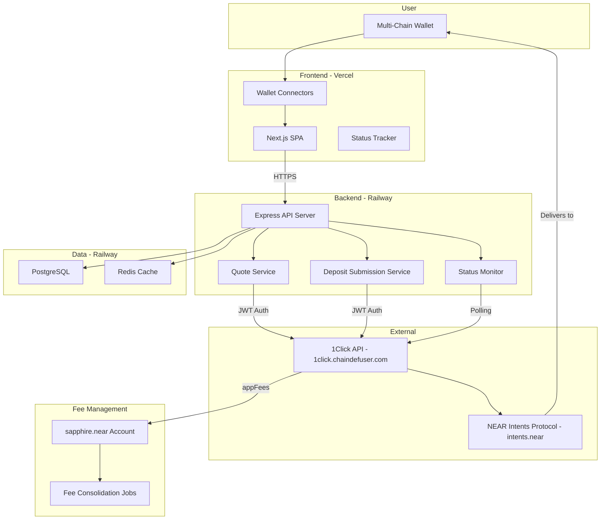
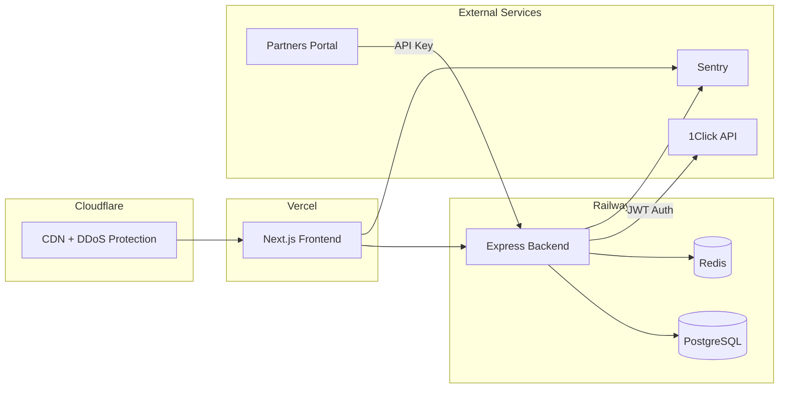

# Sapphire — Architecture & Implementation Plan

> **Working Name:** Sapphire (final name TBD after market research)
> **Purpose:** Cross-chain swap orchestration platform built on NEAR Intents 1Click API
> **Core Value:** Eliminates the "Gas Paradox" and multi-step friction in cross-chain swaps

---

## Problem Statement

Moving tokens between chains via NEAR Intents currently requires:
1. Creating wallets on multiple chains
2. Understanding deposit addresses and manual transfers
3. Having NEAR tokens to pay gas fees before you can swap INTO NEAR (chicken-and-egg)
4. Multi-step deposit → swap → withdraw workflow
5. Finding faucets or borrowing tokens from friends

**Sapphire reduces this to:** Connect wallet → Select source/destination → Send → Done.

---

## System Architecture



---

## Supported Chains & Wallet Integrations

### Fully Supported Chains
| Chain | Address Type | Wallet Library |
|-------|-------------|----------------|
| EVM Chains: Arbitrum, Avalanche, ADI, Aurora, Base, Bera, BNB, Ethereum, Gnosis, Optimism, Plasma, Polygon, XLayer, Monad | 0x-prefixed 42-char hex | WalletConnect / wagmi / RainbowKit |
| Bitcoin | Legacy, SegWit, Taproot | Bitcoin wallet adapter |
| Bitcoin Cash | Legacy P2PKH, P2SH, CashAddr | Bitcoin Cash adapter |
| Dogecoin | P2PKH/Legacy, P2SH | Doge adapter |
| Litecoin | Legacy, Bech32, Taproot | Litecoin adapter |
| NEAR | Named / Implicit | @near-wallet-selector |
| Solana | Base58-encoded Ed25519 | @solana/wallet-adapter |
| Stellar | 56-char base32 | Freighter SDK |
| Starknet | 251-bit hex 0x-prefixed | starknet.js / get-starknet |
| Sui | 32-char hex | @mysten/dapp-kit |
| Tron | Base58Check T-prefix | TronLink SDK / TIP-191 |
| XRP | Classic / Classic+Tag / X-Address | XRP wallet adapter |
| TON | TON address format | TONConnect SDK |

### Partially Supported (Lower Priority)
| Chain | Status |
|-------|--------|
| Cardano | Partially supported |
| ZCash | Partially supported |

### Signing Standards
| Standard | Chains | Status |
|----------|--------|--------|
| NEP-413 | NEAR | Implemented |
| ERC-191 | All EVM | Implemented |
| Raw Ed25519 | Solana | Implemented |
| Passkeys/WebAuthn | Browser-based | Implemented |
| SEP-53 | Stellar | Implemented |
| TIP-191 | TRON | Implemented |
| TONConnect | TON | Implemented |
| BIP-322 | Bitcoin | In Progress |

---

## 1Click API Integration

### Base URL
`https://1click.chaindefuser.com/`

### TypeScript SDK
`@defuse-protocol/one-click-sdk-typescript`

### Key Endpoints
| Endpoint | Method | Purpose |
|----------|--------|---------|
| `/v0/tokens` | GET | Get all supported tokens with assetId, decimals, chain info |
| `/v0/quote` | POST | Request swap quote with deposit address |
| `/v0/deposit/submit` | POST | Submit deposit tx hash to speed processing |
| `/v0/status` | GET | Check swap execution status |

### Quote Request Parameters
| Parameter | Type | Required | Notes |
|-----------|------|----------|-------|
| `dry` | boolean | Yes | true = price preview only, false = generate deposit address |
| `swapType` | enum | Yes | EXACT_INPUT, EXACT_OUTPUT, FLEX_INPUT, ANY_INPUT |
| `slippageTolerance` | number | Yes | Basis points (100 = 1%) |
| `originAsset` | string | Yes | NEP format e.g. nep141:wrap.near |
| `destinationAsset` | string | Yes | NEP format |
| `depositType` | enum | Yes | ORIGIN_CHAIN or INTENTS |
| `amount` | string | Yes | Smallest unit of currency |
| `refundTo` | string | Yes | User's source wallet for failed swaps |
| `refundType` | enum | Yes | ORIGIN_CHAIN or INTENTS |
| `recipient` | string | Yes | Destination wallet address |
| `recipientType` | enum | Yes | DESTINATION_CHAIN or INTENTS |
| `deadline` | date-time | Yes | ISO format, swap must complete by this time |
| `depositMode` | enum | No | SIMPLE (default) or MEMO (Stellar etc) |
| `referral` | string | No | Referral tracking |
| `appFees` | object[] | No | Fee recipients and basis points |
| `quoteWaitingTimeMs` | number | No | Default 3000ms, 0 for fastest |
| `connectedWallets` | string[] | No | Connected wallet addresses |
| `sessionId` | string | No | Client session identifier |

### Swap Status Lifecycle
```
PENDING_DEPOSIT → PROCESSING → SUCCESS
                            → FAILED → REFUNDED (if applicable)
               → INCOMPLETE_DEPOSIT → REFUNDED (deadline passed)
```

### Authentication
- JWT token from Partners Portal (partners.near-intents.org)
- Without JWT: additional 0.1% fee on swaps
- With JWT: only protocol fee (0.0001%)

### Fee Collection
- `appFees` parameter: specify recipient NEAR Intents account + fee in basis points
- Fee collected in the INPUT token (whatever the user is swapping from)
- Fee deposited into the Verifier contract under the recipient account
- Requires periodic consolidation and withdrawal

### Fee Configuration Strategy
- **Initial approach:** Configurable via environment variable (`APP_FEE_BPS`)
- **Default:** 50 bps (0.5%) — placeholder until tiered pricing is finalized
- **Architecture supports tiered pricing:** Backend fee calculation service will accept transaction amount and return appropriate bps
- **Tiered pricing structure:** To be defined by product owner; backend will support a config-driven tier table via `FEE_TIERS` env var
- **Example tier config:** maxAmountUsd: 1000 at 75 bps, maxAmountUsd: 10000 at 50 bps, unlimited at 30 bps
- Fee tier logic implemented in backend so it can be changed without frontend redeployment
- Users see their exact fee amount in the quote preview before confirming

---

## Phased Implementation Plan

### Phase 1: Core Swap Flow (MVP)

**Goal:** End-to-end swap working with EVM wallets as the starting point

#### 1.1 Project Scaffolding
- Initialize monorepo structure (Turborepo)
- Next.js frontend app with TypeScript
- Express.js backend API with TypeScript
- Shared types package
- Environment configuration (.env setup)
- ESLint + Prettier config

#### 1.2 Backend API Server
- Express server with TypeScript
- 1Click SDK integration (`@defuse-protocol/one-click-sdk-typescript`)
- API routes:
  - `GET /api/tokens` — Proxy to 1Click /v0/tokens, cache in Redis
  - `POST /api/quote` — Construct and forward quote request with appFees
  - `POST /api/deposit/submit` — Forward deposit tx hash
  - `GET /api/status/:depositAddress` — Poll and return swap status
- JWT API key management (server-side only)
- Input validation (wallet addresses, amounts, chain selections)
- CORS configuration for frontend origin
- Rate limiting per IP/session

#### 1.3 Database Setup
- PostgreSQL schema:
  - `transactions` table: id, session_id, origin_asset, destination_asset, amount, deposit_address, recipient, refund_to, status, quote_details (JSON), app_fee_bps, created_at, updated_at
  - `status_history` table: id, transaction_id, status, timestamp, metadata (JSON)
- Redis for:
  - Token list cache (TTL: 5 minutes)
  - Active transaction status cache
  - Rate limiting counters

#### 1.4 Frontend — Core UI
- Single page layout with swap form:
  - From Chain selector
  - From Currency selector (populated from wallet balances)
  - From Amount input
  - To Chain selector
  - To Currency selector (populated from 1Click token list filtered by chain)
  - To Chain Wallet address input
- Quote preview display (exchange rate, fees breakdown, estimated time)
- Confirmation dialog
- Transaction status tracker with real-time updates

#### 1.5 Frontend — EVM Wallet Integration (First Chain Group)
- wagmi + RainbowKit for EVM wallet connection
- MetaMask, Rabby, Rainbow, WalletConnect support
- Balance fetching via RPC
- Transaction signing for deposit to 1Click deposit address

#### 1.6 End-to-End Integration Testing
- Complete flow: Connect EVM wallet → Select tokens → Get quote → Deposit → Track status
- Error handling for failed quotes, network issues, insufficient balance
- Refund flow verification

---

### Phase 2: Multi-Chain Wallet Expansion

**Goal:** Support all major chains beyond EVM

#### 2.1 Solana Wallet Integration
- @solana/wallet-adapter-react
- Phantom, Solflare, Slope support
- SOL and SPL token balance fetching
- Transaction signing

#### 2.2 NEAR Wallet Integration
- @near-wallet-selector
- MyNearWallet, Meteor, Sender support
- NEAR and NEP-141 token balances
- Transaction signing

#### 2.3 Sui Wallet Integration
- @mysten/dapp-kit
- Sui Wallet, Suiet support
- SUI and token balance fetching

#### 2.4 Additional Chain Integrations
- TON via TONConnect SDK
- Tron via TronLink SDK
- Stellar via Freighter SDK
- Bitcoin via dedicated adapter (BIP-322 when available)
- Starknet via starknet.js
- XRP, Litecoin, Dogecoin, Bitcoin Cash adapters

#### 2.5 Unified Wallet Manager
- Abstract wallet interface supporting all chains
- Chain-agnostic balance fetching
- Standardized transaction signing interface
- Wallet state management (connected, disconnecting, error states)

---

### Phase 3: Fee Management & Revenue

**Goal:** Automated fee collection, consolidation, and withdrawal

#### 3.1 NEAR Intents Account Setup
- Register `sapphire.near` (or chosen name) on NEAR mainnet
- Configure as appFees recipient in all quote requests

#### 3.2 Fee Consolidation System
- Scheduled job to check balances across all token types in Verifier
- Automated swap of accumulated tokens into preferred asset (USDC/NEAR)
- Withdrawal from Verifier to operating wallet

#### 3.3 Fee Accounting Dashboard (Internal)
- Track fee revenue by token, by day, by chain pair
- Outstanding balances in Verifier
- Consolidation history
- Revenue analytics

---

### Phase 4: Production Hardening

**Goal:** Monitoring, security, reliability for production traffic

#### 4.1 Monitoring & Alerting
- Transaction success rate tracking
- Transaction latency monitoring
- 1Click API health checks
- Fee account balance alerts
- Error tracking (Sentry)
- Uptime monitoring

#### 4.2 Security
- API key rotation mechanism
- DDoS protection (Cloudflare)
- Input sanitization and validation hardening
- HTTPS enforcement
- CSP headers

#### 4.3 UX Polish
- Responsive design (mobile-friendly)
- Loading states and animations
- Error messages and recovery guidance
- Transaction history (per wallet address)
- Share/bookmark transaction status links

#### 4.4 Performance
- Token list caching optimization
- Quote response caching (dry runs)
- Frontend bundle optimization
- API response compression

---

## Tech Stack Summary

| Layer | Technology | Rationale |
|-------|-----------|-----------|
| Frontend | Next.js 14+ (App Router) | SSR capability, great DX, Vercel deployment |
| UI Framework | Tailwind CSS + shadcn/ui | Rapid styling, consistent components |
| Wallet - EVM | wagmi + RainbowKit | Industry standard, WalletConnect support |
| Wallet - Solana | @solana/wallet-adapter | Official Solana adapter |
| Wallet - NEAR | @near-wallet-selector | Official NEAR adapter |
| Wallet - Sui | @mysten/dapp-kit | Official Sui adapter |
| Wallet - TON | TONConnect SDK | Official TON adapter |
| Backend | Express.js + TypeScript | Lightweight, matches SDK language |
| 1Click SDK | @defuse-protocol/one-click-sdk-typescript | Official TypeScript SDK |
| Database | PostgreSQL | Relational, audit trail, fee accounting |
| Cache | Redis | Token cache, status cache, rate limiting |
| Frontend Hosting | Vercel | Zero-config Next.js, edge network, free tier |
| Backend Hosting | Railway | Simple container deployment, PostgreSQL + Redis included, auto-scaling |
| Monorepo | Turborepo | Shared types, efficient builds |
| Error Tracking | Sentry | Industry standard, free tier |

---

## Deployment Architecture



---

## Project Structure

```
sapphire/
├── apps/
│   ├── web/                    # Next.js frontend
│   │   ├── app/                # App Router pages
│   │   ├── components/         # UI components
│   │   │   ├── swap/           # Swap form components
│   │   │   ├── wallet/         # Wallet connection components
│   │   │   └── status/         # Transaction status components
│   │   ├── hooks/              # Custom React hooks
│   │   ├── lib/                # Utility functions
│   │   └── services/           # API client services
│   └── api/                    # Express backend
│       ├── routes/             # API route handlers
│       ├── services/           # Business logic
│       │   ├── oneclick.ts     # 1Click SDK wrapper
│       │   ├── tokens.ts       # Token list management
│       │   └── transactions.ts # Transaction lifecycle
│       ├── middleware/          # Auth, rate limiting, validation
│       ├── db/                 # Database models and migrations
│       └── jobs/               # Scheduled jobs (fee consolidation)
├── packages/
│   └── shared/                 # Shared types and constants
│       ├── types/              # TypeScript interfaces
│       └── constants/          # Chain configs, asset mappings
├── turbo.json
├── package.json
└── .env.example
```

---

## Key Risk Mitigations

| Risk | Mitigation |
|------|------------|
| 1Click API downtime | Health monitoring, graceful degradation, user-facing status page |
| Failed swaps | Automatic refund via refundTo parameter, status tracking in DB |
| Fee accumulation in random tokens | Scheduled consolidation into USDC/NEAR |
| API key exposure | Server-side only, never in frontend bundle |
| High-value transaction failures | Transaction size limits initially, monitoring alerts |
| Wallet compatibility issues | Phased rollout by chain, thorough testing per wallet |
| Rate limiting by 1Click | Request queuing, caching dry-run quotes |

---

## References

- [NEAR Intents Documentation](https://docs.near-intents.org/near-intents)
- [1Click API Docs](https://docs.near-intents.org/near-intents — Distribution Channels — 1Click API)
- [1Click TypeScript SDK](https://github.com/defuse-protocol/one-click-sdk-typescript)
- [NEAR Intents Examples](https://github.com/near-examples/near-intents-examples)
- [OpenAPI Spec](https://1click.chaindefuser.com — referenced in docs)
- [Partners Portal](https://partners.near-intents.org)
